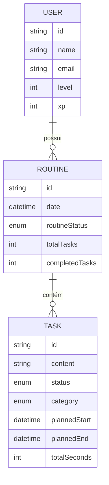

# Beckend Brain 🧠

API robusta para gerenciamento de tarefas e produtividade diária, construída com foco em **Domain-Driven Design (DDD)**, **Solid Principles** e **Testability**.

## 🚀 Tecnologias

- **NodeJS** (Express 5)
- **TypeScript**
- **Prisma ORM** (SQLite)
- **Jest** (Testes de Integração e Unitários)
- **Zod** (Validação de Esquemas)


## 📋 Funcionalidades Principais

- **Gerenciamento de Usuários**: Sistema de níveis, experiência (XP) e conquistas (estrelas).
- **Rotinas Diárias**: Criação automática de rotinas baseada na data das tarefas.
- **Controle de Tarefas**: 
  - Criação com categorias (Work, Personal, Study, Break).
  - Controle de estado: `Start`, `Pause`, `Done`.
  - Cálculo automático de duração real vs. prevista.

## 🏗️ Arquitetura

O projeto segue uma estrutura organizada por módulos e separação de responsabilidades:

- **Entities**: Lógica de negócio pura e imutável.
- **Services**: Casos de uso e orquestração de dependências.
- **Repositories**: Abstração da camada de dados (Prisma / In-Memory).
- **Controllers**: Handlers HTTP e validação de entrada.

## ⚙️ Instalação e Execução

1. **Instale as dependências**:
   ```bash
   npm install
   ```

2. **Configure as variáveis de ambiente**:
   Crie um arquivo `.env` baseado no `.env.example` (se disponível) ou adicione:
   ```env
   DATABASE_URL="file:./dev.db"
   ```

3. **Gere o cliente do Prisma**:
   ```bash
   npx prisma generate
   ```

4. **Execute as migrações**:
   ```bash
   npx prisma migrate dev
   ```

5. **Inicie o servidor em desenvolvimento**:
   ```bash
   npm run dev
   ```

## 🧪 Testes

O projeto conta com uma suíte de testes de integração que utilizam repositórios in-memory para garantir velocidade e isolamento.

```bash
# Executar todos os testes
npm test

# Executar um teste específico
npm test src/tests/integration/services/create.task.test.ts
```

## 📊 Modelo de Dados



---
Desenvolvido com ❤️ para aumentar a produtividade.
